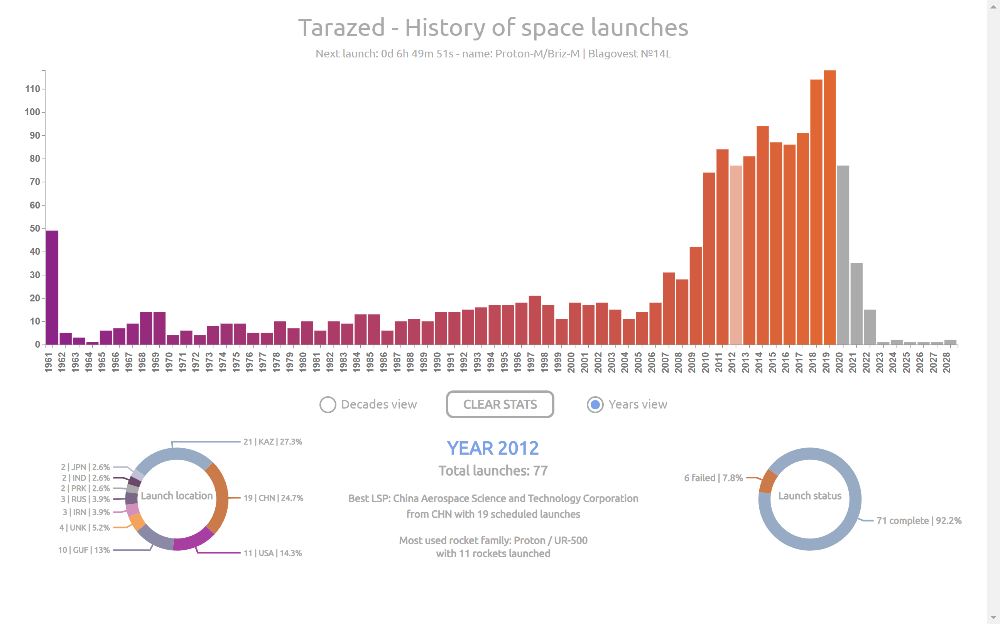

# Tarazed - History of space launches

### Status: v 1.1

## Introduction
Tarazed takes every **space launch** in history from [Launchlibrary](https://launchlibrary.net) and displays a visual representation using **d3js** and **javascript**. This kind of visualization should be easy to embed in another web page. For the available informations, refer to the [API documentation](https://launchlibrary.net/docs/1.4.1/api.html).

## Task
> How can a user understand the progression behind the overall evolution of the space travel phenomenon?

The specific task is to display the history of the space travels from 1961 until the last scheduled launch in a clear and easy to understand representation, focusing on **group of launches** instead of single launches. 
The user can see the progress on a time based representation, interacting with the graph to see the **statistics** of each year or decade, and easily **comparing** them.
Approximately, there are **2000 launches**, **250 agencies**, **15 launch locations** and a time window of **60 years** (at the time of writing).

## Features
- Dynamic data! The visualization is **automatically updated** when a new launch is scheduled
- Interactive visual representation, **advanced stats** (completed/failed, launch location, total launches and more)
- **Countdown** to the next scheduled launch
- **Compare** launches across 2 or more years or decades
- The sources are easy to **customize** and understand
- A simple **page template** to display the graph (including a customizable [particles.js](https://vincentgarreau.com/particles.js/) background)

## Screenshots
### Basic layout (tarazed-clean folder)

### Template layout (tarazed-template folder)

## How to
Just clone the repo! You can use it as it is (use an http local server running the command `python -m http.server 8080`), or import the script and the css in another html page: make sure to add 4 `div`s with the correct id (it must match the `idToSelect` variable in the js file). The customizable elements are in the script iteself and in the css. 
